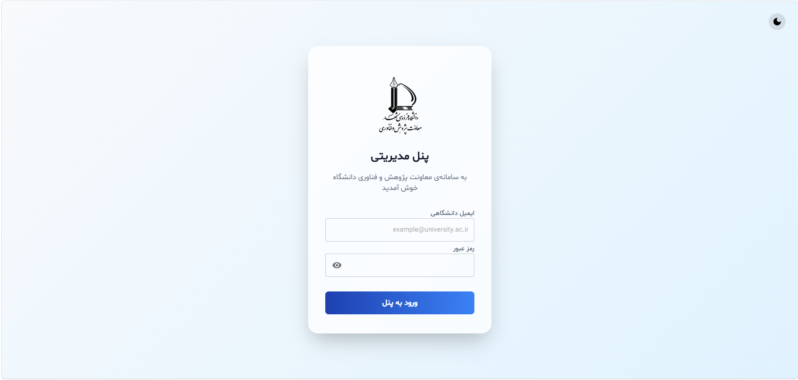
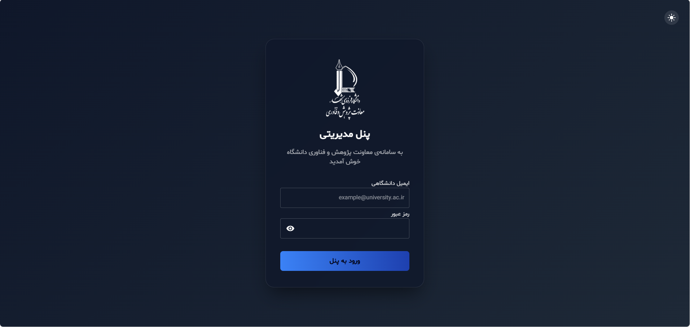
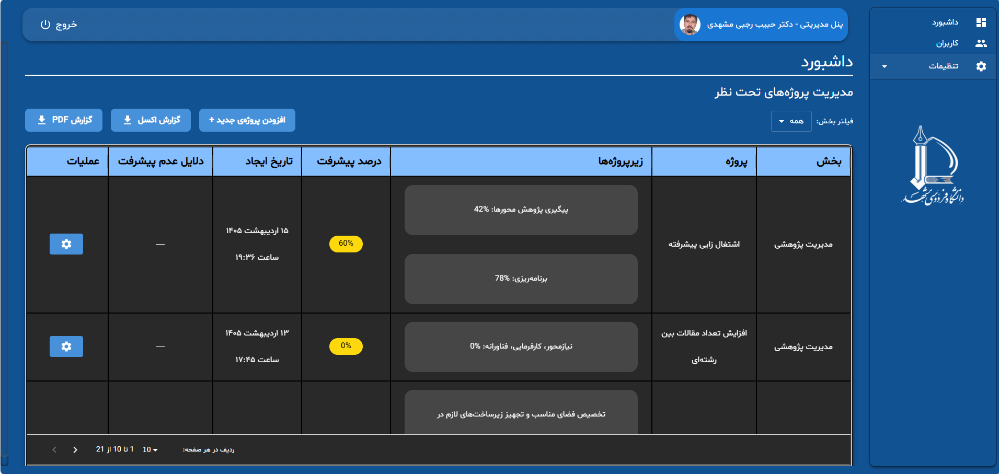
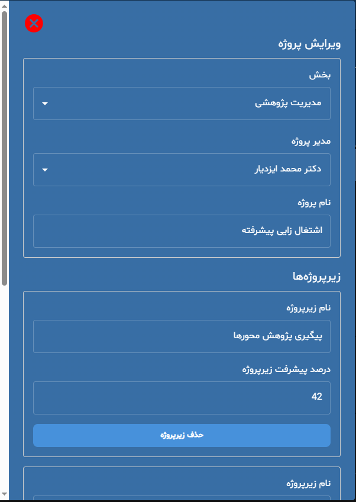

# 🛡️ Management Panel

> A role-based project monitoring and management platform designed to help managers track and manage their team's projects.

## 📌 Overview

Management Panel is an internal web application developed to provide a centralized platform for monitoring projects across different management teams.

The platform allows administrators to create and manage projects, assign projects to managers, monitor their progress, and maintain an organized overview of ongoing work.

Each manager has access only to the projects assigned to their own management scope, while administrators have a broader view and management capabilities across the platform.

## ✨ Key Features

### 👨‍💼 Project Management

* Create, edit, and delete projects
* Assign projects to managers
* Monitor project status and progress
* View project information in a structured interface
* User-friendly project management table
* Easy project filtering and management workflows

### 🔐 Role-Based Access Control

The platform provides different levels of access based on user roles.

**Administrators**

* Manage managers and their projects
* Create and edit projects
* View projects across management teams
* Manage project assignments
* Monitor the overall project landscape

**Managers**

* Access their own dashboard
* View projects assigned to their management scope
* Manage and monitor relevant project information
* Access only the data permitted for their role

### 🎨 Dashboard Customization

Each manager can personalize their dashboard by selecting a preferred theme from the available color and visual options.

This provides a more personalized user experience while maintaining a consistent application structure.

### 🌓 Theme Support

* Light and dark visual modes
* Custom dashboard themes
* Consistent UI across different theme configurations

## 🛠️ Technology Stack

### Frontend

* React.js
* JavaScript
* Responsive Web Design

### Backend

* Node.js
* Express.js
* RESTful APIs

### Database

* PostgreSQL
* Supabase

The application initially used Supabase for data storage and was later migrated to PostgreSQL as the project evolved.

## 🏗️ Application Architecture

The application follows a client-server architecture with React.js powering the frontend and Express.js providing the backend API layer.

```text
┌──────────────────────────────┐
│          React.js            │
│        Client / UI           │
│                              │
│ Dashboard & Project Views    │
│ Tables & Management Forms    │
│ Theme & UI Customization     │
└──────────────┬───────────────┘
               │
               │ REST API
               ▼
┌──────────────────────────────┐
│        Express.js            │
│        Backend API            │
│                              │
│ Authentication               │
│ Authorization                │
│ Business Logic               │
│ Project Management            │
└──────────────┬───────────────┘
               │
               ▼
┌──────────────────────────────┐
│         PostgreSQL           │
│          Database            │
└──────────────────────────────┘
```

## 👨‍💻 My Role & Technical Contributions

I was responsible for the end-to-end development of the application, including:

* Frontend development with React.js
* Backend development with Express.js
* REST API development
* Database design and integration
* Authentication and authorization
* Role-based access control
* Project management workflows
* Manager and administrator access management
* Dashboard development
* Theme and UI customization
* Responsive interface implementation
* Database migration from Supabase to PostgreSQL
* Debugging, maintenance, and continuous improvements

## ⭐ Project Highlights

* Designed and developed from scratch for real-world internal use
* Role-based project visibility and access control
* Centralized project monitoring across management teams
* User-friendly project management interface
* Customizable manager dashboards
* Light and dark visual modes
* Individual dashboard theme selection
* React.js frontend with Express.js backend
* Migration from Supabase to PostgreSQL
* Designed with maintainability and usability in mind

## 📸 Screenshots

### 🔐 Login Page

The authentication interface provides secure access to the management platform.



### 🌙 Login — Dark Mode

The login interface also supports the application's dark visual mode.



### 📊 Manager Dashboard

The manager dashboard provides an overview of projects available within the manager's authorized scope.



### ✏️ Project Management

The project management interface provides a user-friendly way to create, edit, and manage project information.



## 📍 Project Status

The application was developed for real-world internal use and has been maintained and improved based on operational requirements and user feedback.

## 🔒 Source Code & Privacy

The source code of this project is private due to project ownership and confidentiality.

This public repository is provided as a case study to showcase the project's purpose, functionality, architecture, technology stack, and development experience.
